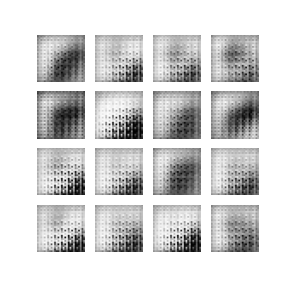

<h1>MNIST (american) sign language</h1>

<h2>About</h2>

The project is a POC for a sign language (ASL) recognition system without two signs for "J" and "Z" as they require a motion which could't be shown by a simple image.
The dataset can be found  on [Kaggle](https://www.kaggle.com/datamunge/sign-language-mnist).

ASL alphabet:

<h2>Results</h2>

Two notebooks were created both containing different models.

The first one [classification](src/classification.ipynb) notebook contains model responsible for classification of the signs. We've managed to achieve almost 100% accuracy. The model was tested on a test set of around 7000 thousand images.
The confusion matrix for the set is shown below.

---

The second [generator](src/generator.ipynb) notebook contains models responsible for generating new images. For that we've created a GAN network consisting of a generator and a discriminator. The first one generates images from random noise and the second one tries to guess if it's a real or fake image.

Both of these models were trained for about 50 epochs and although far from perfect, they were able to generate images resembling the original data. The progress of the generator and the quality of generated images are shown on the below gif.

---

<h2>How to run</h2>

There are to ways to run the notebooks.

1. Run the notebooks in the src directory.:

    To run the training process, you need to install necessary dependencies which are present in the requirements.txt file. 
    You need to also download the dataset from the link in the About section and place it in the data folder.

2. Run the docker image.:

    Build: From the root directory run `docker build -t [image_name] .` (set image_name to any name you want). 
    Run: Then run `docker run --gpus all [image_name] bash -c "python src/classification.py"` if your docker doesn't support gpu run `docker run [image_name] bash -c "python src/classification.py"` (image_name same as set during build process)